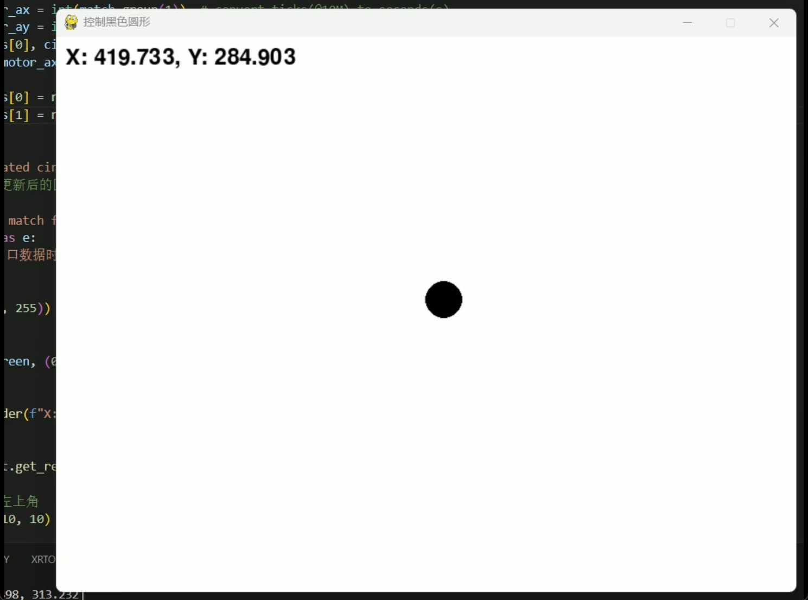

# lighthouse_visualizer
show position on screen, from SCUM/nRF...
2d visualization, please use `test_pygame_gpt4o.py`, and `github.com/atomic-hkust-gz/scum-test-code/releases/tag/2d_visualize-v1.0.0`. 

If all things work well, your code would be run like this:
