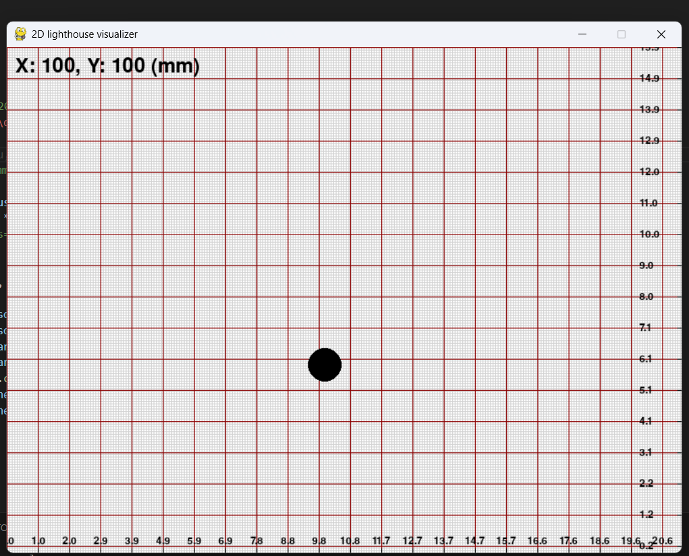

# lighthouse_visualizer
show position on screen, from SCUM/nRF...
2d visualization, please use `test_pygame_gpt4o.py`, and `github.com/atomic-hkust-gz/scum-test-code/releases/tag/2d_visualize-v1.0.0`. 

## 2D lighthouse visualizer

Please check the height of lighthouse and then modify `lighthouse_height` in _line 124_.
Please change the `serial port` to your device port number.

If all things work well, your code would be run like this:
